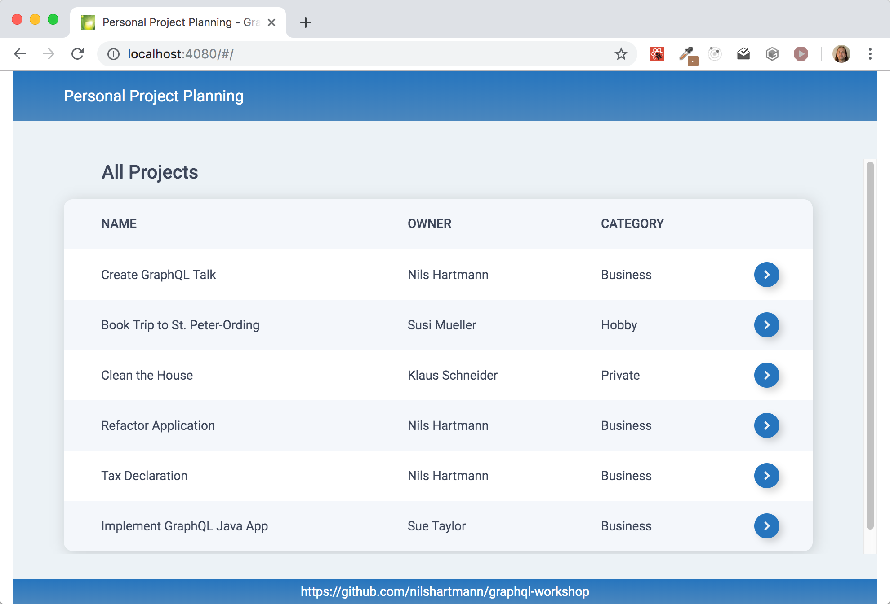

# GraphQL Java Workshop Requirements and Setup

Here you will find all the requirements and preparations for the GraphQL workshop.

## Requirements

**Four your Laptop/PC**

For the exercises you need:

- JDK 11 (for example OpenJDK)
- Gradle
- Git
- a Java IDE (for example IntelliJ or Eclipse)
- Free ports on your machine: 5000 and 5010

**During the workshop**

- As we may need to install updates before and during the training, please make sure that internet access works on your computer during the training - also **also for git and gradle** (consider proxies, firewalls, VPN, ...!).
- **I'm happy if you have your camera on** during the training so we can see each other 🎥. Please only turn on the microphone if you want to say something or ask a question (which you are of course allowed to do at any time!).
- Wifi is convenient, but especially for (long) streaming sessions, a wired network is more stable than wifi, so if in doubt, plug in the cable (and deactivate wifi) 😊

# Installation and preparation of the workspace for the training

- Please perform the following steps **once before the workshop** to save us time during the workshop.
- Note: you will probably need to clone the repository again during the workshop and also run `gradle build` again, but these should only be minor changes. Please make sure that you have access to git and gradle during the workshop (or internet access for that matter).
- Please make sure to use the `code` directory (and **not** the `app` directory).

## Step 1: Clone the Git repository

```
git clone https://github.com/nilshartmann/graphql-java-workshop
```

## Step 2: Build and run the "UserService"

In folder `code/userservice` build the UserService and start it:

```
cd code/userservice
./gradew clean bootRun
```

- The User Service application should run now (Output on the console: `Started UserServiceApplication`)
- The service required **port 5010**, please make sure, that this port is free
- You can test the service by calling `http://localhost:5010/users` in the browser. It should return a list of user (JSON) objects.

Since we will not be working on this service, you do not need to import the code into your IDE. It is enough to run this service during the workshop.

## Step 3: Build and run "ProjectMgmtApp"

In folder `code/backend` please build and start the example application we will work on during the workspace (ProjectMgmtApp)

```
cd code/backend
./gradew clean bootRun
```

- The application should now be running (output on the console: `SERVER RUNNING`).
- The service needs **port 5000**, please make sure that the port is free.
- You can test if the application is running correctly by calling `http://localhost:5000/` in the browser. The GraphQL Playground should appear (as long as no error message appears, all is well 😉).

**Importing into the IDE**

We will do exercises in this application during the workshop, so you should also import this project (`backend`) into your IDE and make sure that it compiles there and that you can run and debug it from there if necessary.
In IntelliJ for example it should be enough to open the folder `code/backend` to import the (Gradle) project.

## Questions or problems

If you have any questions or problems, you can contact me. You can find my contact details [on my homepage](https://nilshartmann.net).

I look forward to our workshop!


